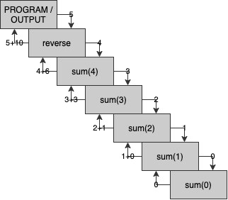
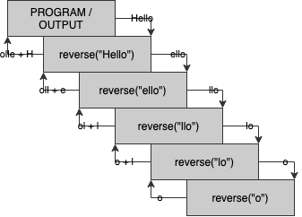

# **Recursion**

Often seen as one of the most challenging aspects of this course, it may seem daunting. But once you break it down, recursion is actually pretty interesting or maybe even fun. But first, to properly utilise it, you need to understand what the fundementals of recursion are and why they are so.

## **Calling functions in functions**

You may already know that you can call other functions from within another method, generally you would split a program up into generalised sub-methods. To call to return a variable used for calculations or for a visual or console output. Here is an example of an unmodified method and then one with sub-methods.

```java
public static int numWithinMargin(int[] arr, int gap) {
    int largest = 0, count = 0;
    for (int i = 0; i < arr.length; i++) {
        if (largest < arr[i]) largest = arr[i];
        // Find the largest number in the array
    }

    for (int i = 0; i < arr.length; i++) {
        if (largest - gap <= arr[i] && largest + gap >= arr[i]) count++;
        // If arr[i] is within gap margin of the largest number in the array
    }

    return count;
}
```

```java
public static int numWithinMargin(int[] arr, int gap) {
    int largest = getLargest(arr), count = 0;
    for (int i : arr) if (i.isInRange(largest)) count++;
    return count;
}

public static int getLargest(int[] arr) {
    int largest = 0;
    for (int i : arr) if (largest < i) largest = i;
    return largest;
}

public boolean isInRange(int num, int diff) {
    return num - diff <= this && num + diff >= this;
}
```

## **Calling functions in themselves**

Recursion is like these, but instead of calling different sub-methods from our parent function, we call our method from within the method. This is generally done in the return part of the method so we can pass down the variables to another smaller part of the function. Let's write a recursive method to find the sum of the numbers from 1 to n. First we'll do a normal function, then a recursive way.

```java
public static int sum(int n) {
    int total = 0;
    for (int i = 1; i <= n; i++) total += i;
    return total;
}
```

```java
public static int sum(int n) {
    return sum(n);
}
```

## **Fundementals of recursion**

Running the second method, which is an incorrect method for recursion will return the following error in the console `Exception in thread "main" java.lang.StackOverflowError`. Breaking down this error we see that the problem lies with an error with our program 'stack' overflowing. But what does this mean?

The term 'Stack' will become more familar in COMP2010, but it's a data structure that acts like a tube, when we make a recursive call down another layer it's like putting another ring in the tube and when we exit out of the sub-function it's like taking a ring out of the tube. If the compiler sees we're in a loop adding more and more rings without and change or foreseeable exit condition, the tube will overflow and it will halt our program. So to prevent this from happening there are some fundementals on recursion you should keep into account.

> The method must have a base condition from which it begins to go back up the recursion chain and exits going down with more, done with just a returning a variable and not calling the function. This is the part from the previous example when we begin to remove the rings from the tube.

```java
public static int sum(int n) {
    if (n <= 0) return 0;
    return sum(n);
}
```

> Next we need to make sure each time we call the function down another level, the data set we input with is 'strictly' smaller than the one it was called with.

```java
public static int sum(int n) {
    if (n <= 0) return 0;
    return sum(n-1);
}
```

Now if we called this function with `System.out.println(sum(9));` we'd expect it to print 45 as 1 + 2 + ... + 8 + 9 = 45. But instead it prints 0. This is because of the third fundemental we haven't done.

> Ensure the recursive call is designed to create the solution to the problem.

Since when we call a function it generally returns a value unless it's void. We can use this to pass a formula in our return statement that adds the current value on to the recursive call. So that it keeps passing down the next lowest integer and passing back up the sum up to that number added with the current number.

```java
public static int sum(int n) {
    if (n <= 0) return 0;
    return n + sum(n-1);
}
```

## **Diagram of recursion**

If you're still not understanding, here's a diagram to understand what happens when we call the function with a value of 5, which would return 5 + 10 / 15 on the output.



## **Expanding on recursion**

We can also use conditionals to pass down with a different formula, skip numbers by not using a forumula and modifying the exit conditions. So let's modify our sum program to do the following.

* Only create the sum of even numbers
* If the number is divisible by 5, double the running count
* If the input is negative, make it postive and find the sum like `sum(-4) = 10`

```java
public static int sumCustom(int n) {
    if (n < 0) return sumCustom(-n);
    else if (n == 0) return 0;
    else if (n % 2 == 1) return sumCustom(n-1);
    else if (n % 5 == 0) return 2 * sumCustom(n-1);
    return n + sumCustom(n-1);
}
```

## **Recursive operations on strings**

Alright, we've done the basics with integers, but as another example we'll do recursion operations on strings. Since technically strings are arrays of characters, we can strictly reduce the string, but subdiving it's array with the non-static default method 'substring', this can be done with:

```java
String str = "Hello, world!";
str = str.substring(1,5);
System.out.println(str);

>> ello
```

So if we want to write a method to reverse the string that was input. We'd have to do the following with what we have learn above. Since we have a strictly decreasing data set, when we have a string with one character or less, we can just return the string as it as the lowest part of our function tree. With our function if we think about it, if we append a character at the end of the recursive call, the characters will be appended on the back in order, this 

```java
public static String reverse(String input) {
    if (str.length() <= 1) return str;
	// The exit condition
    return reverse(str.substring(1,str.length())) + str.charAt(0);
    // The decreasing set and the formula
}
```

To visualise what is happening, here's another stack diagram of the recursive calls on this function and how it generates the output of "olleH".

