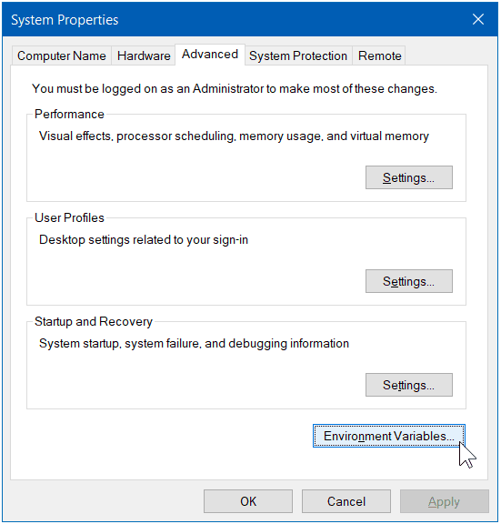

# **Debugging Eclipse Errors**

## **My JDK isn't installed**

If you have downloaded the JDK from the Oracle website and ran the installer on Windows. If you open `Command Prompt` and run the following command `java -version`. If it says that this is not a valid command or it has another version like 1.8 when you installed 14, then you need to do the following if on Windows.

When you have your windows search bar open type type `env` and choose `Edit the system environment variables`. Once open click on the `Environment Variables…` button.

